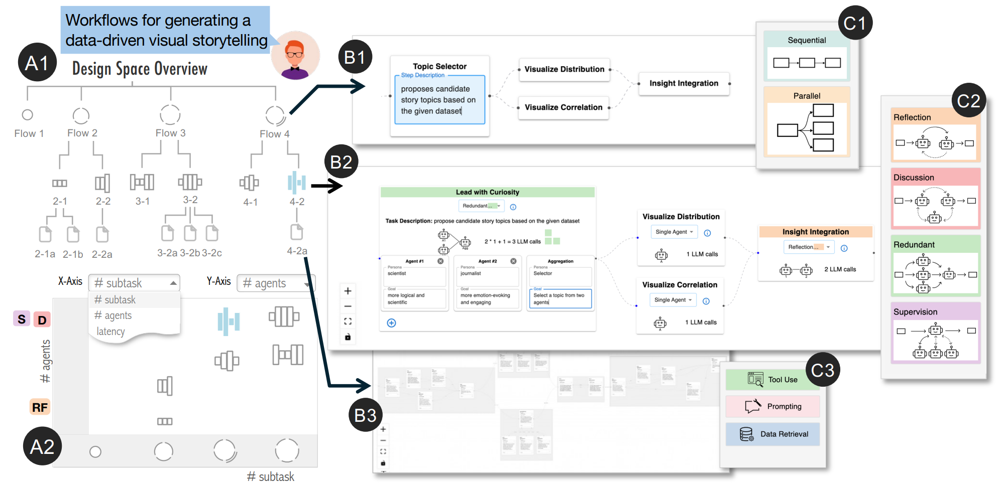

<!-- docs/README.md -->

# FlowForge

## 👋 [Play with FlowForge](https://vis-flow-forge-demo.vercel.app)

--- 

FlowForge is an interactive visualization system designed to simplify and enhance the creation of multi-agent workflows. In multi-agent workflow development, practitioners face a vast and intricate design space with complex trade-offs, where current practices rely heavily on intuition and expertise as solutions. This unstructured exploration can lead to design fixation or an unstructured, time-consuming exploration of trial-and-error.

To address these issues, FlowForge structures the workflow design process into three hierarchical levels (task planning, agent assignment, and agent optimization). This layered approach helps practitioners transition smoothly from high-level workflow concepts to concrete implementations, ensuring transparency and control at each stage. Additionally, FlowForge provides in-situ suggestions derived from well-established design patterns in multi-agent research. These actionable recommendations guide users toward more effective solutions, reducing the burden of manually synthesizing best practices.

In contrast to fully automated multi-agent solutions that often generate opaque or suboptimal workflows, FlowForge offers:

- **Structured Exploration**: A visually organized hierarchy and performance-based comparison, enabling users to seamlessly move from high-level planning to detailed design decisions and implementations while comparing alternative solutions across multiple performance metrics.
- **Context-Aware Guidance**: Context-aware in-situ suggestions are provided at each level as users navigate the design space, enhancing the workflow creation process with practical guidance.

---

  

<b>FlowForge facilitates the creation of multi-agent workflows through structured, guided visual exploration of the design space.</b> This is achieved by coordinating a hierarchical tree view (A1) and a scatter plot (A2), both of which use a novel glyph design to represent each workflow’s computational cost and level of abstraction. Users can select a workflow for detailed inspection in the Canvas View (B1-B3), which supports semantic zooming that reveals more abstract representations and greater detail based on zoom level. Additionally, in-situ suggestions based on well-established design patterns are provided to guide users as they navigate the design space (C1-C3).
